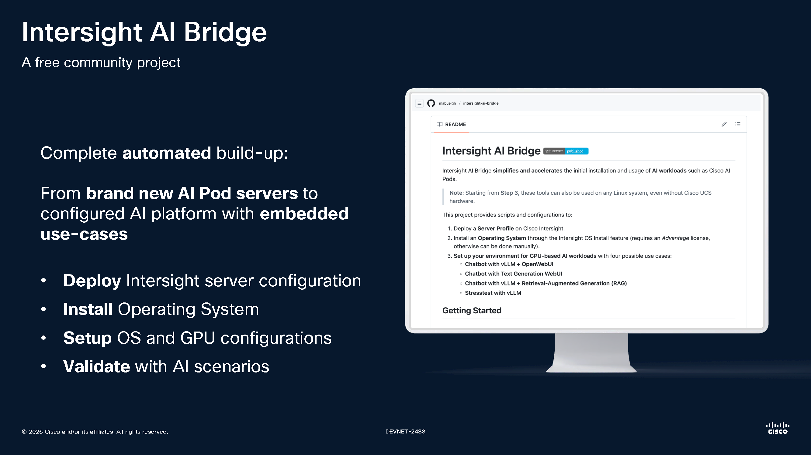
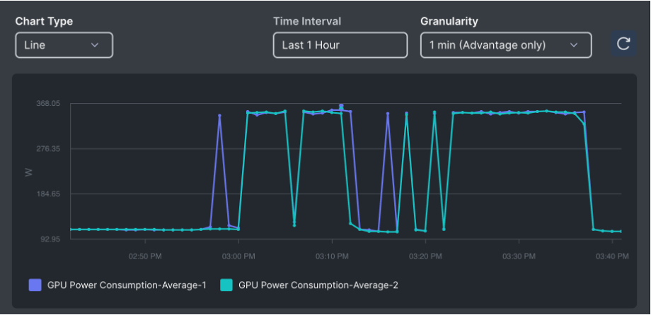

# Intersight AI Bridge [](https://developer.cisco.com/codeexchange/github/repo/mabuelgh/intersight-ai-bridge)

Intersight AI Bridge **simplifies and accelerates** the initial installation and usage of **AI workloads** such as Cisco AI Pods.


<h6>

[](https://www.ciscolive.com/c/dam/r/ciscolive/emea/docs/2026/pdf/DEVNET-2488.pdf)
Featured at Cisco Live 2026 EMEA : [DEVNET-2488](https://www.ciscolive.com/c/dam/r/ciscolive/emea/docs/2026/pdf/DEVNET-2488.pdf)
</h6>

This project provides scripts and configurations to:  
1. Deploy a **Server Profile** on Cisco Intersight.  
2. Install an **Operating System** through the Intersight OS Install feature (requires an *Advantage* license, otherwise can be done manually).  
3. Automated set up of the **environment** for GPU based infrastructure
4. **Deploy AI workloads** with predefined use cases

> [!TIP]
> Each step can be used independently.

> [!CAUTION]
> This project can be used for OpenShift deployment or Ubuntu. Please follow the righ guidelines for your endgoal.
> There is no preferred way to use AI Pods, however Cisco Validated Designs suggest to use OpenShift.
> Ubuntu method can be used for easy and quick proof of concept deployment where OpenShift is recommended for production deployment.

## Getting Started

### Step 1: Deploy the Server Profile on Intersight
*[Detailed instructions for Step 1](intersight/tutorials/Step_1.md)*

(Can be skipped if you prefer manual installation or are not using Intersight.)


### Step 2: Install the Operating System through Intersight OS Install feature
You can either:
- Install **Red Hat OpenShift** through automation scripts -> *[Detailed instructions](intersight/tutorials/OCP_Step_2.md)*
- Install **Ubuntu** as Operation system through Intersight OS Install feature -> *[Detailed instructions](intersight/tutorials/Linux_Step_2.md)* 

(Can be skipped if you prefer manual installation or are not using Intersight.)


### Step 3: Requirements Installation & Setup
You have the choice to setup for Ubuntu or Red Hat OpenShift:
- Deploy and setup for **Red Hat OpenShift** -> *[Detailed instructions](intersight/tutorials/OCP_Step_3.md)*
- Deploy and setup for **Ubuntu** :

> [!NOTE]
> This can also be used on any Linux system, without Cisco UCS hardware or Intersight licenses.

1. Connect to the server OS, clone this repository, navigate into the project directory and make shell scripts executable:
   ```bash
   git clone https://github.com/mabuelgh/intersight-ai-bridge
   cd intersight-ai-bridge
   chmod +x *.sh
   ```

2. If needed, define the variable *PROXY_URL* in **setup.sh** file, that will be used to configure system proxy & Docker proxy:
   ```bash
   sudo nano setup.sh

   PROXY_URL="http://proxy.example.com:80" # <--- REPLACE WITH YOUR ACTUAL PROXY
   ```

3. Run the setup script:
   ```bash
   ./setup.sh
   ```

4. Verify installation after reboot of the OS:

   ```bash
   cd intersight-ai-bridge
   ./checking.sh
   ```
   
   This process will trigger the creation of a Docker container. It will then display your GPUs inside the container to confirm the Nvidia container toolkit installation.

### Step 4: Use Case Scenarios
You have the choice to launch use case scenarions for Ubuntu or Red Hat OpenShift:
- Deploy and setup for **Red Hat OpenShift** -> *[Detailed instructions](intersight/tutorials/OCP_Step_4.md)*
- Deploy and setup for **Ubuntu** :

After setup, choose one of the following scenarios:

#### 1. Chatbot: Text Generation WebUI
Launch with the Text Generation WebUI project:  
```bash
./scenario1.sh
```
**Note**: You may need to load your model in the settings page before using it.

#### 2. Chatbot: vLLM + OpenWebUI
Launch vLLM with OpenWebUI:  
```bash
./scenario2.sh
```
**Note**: If not done automatically, select your model on the top left corner of OpenWebUI.

#### 3. Chatbot: vLLM + RAG (File Context)
Launch vLLMs with RAG for file-based context:  
```bash
./scenario3.sh
```
**Note**: This project comes with sample files about fictives company descriptions.<br>
For dual GPU infra, another file *docker-compose-vllm-RAG-dual-GPU.yml* can be used instead of *docker-compose-vllm-RAG.yml*.

#### 📖 Sample of questions to ask based on the RAG files in the project
Once running, you can ask questions such as:
- *"When was Chronos Innovations created?"*  
- *"What's the business of Nimbus Orchard?"*  
- *"What is LuminaTech Solutions?"*


#### 4. Showcase regular GPU usage (Stresstest): vLLM
Launch vLLMs with curl containers:
```bash
./scenario4.sh
```
> [!IMPORTANT]
> This scenario was made for dual GPU infra, remove the "gpu2" containers in *docker-compose-vllm-stresstest.yml* if necessary.


## Monitoring
- You can monitor GPUs with commands: "**nvidia-smi**" & "**nvtop**"
- **Intersight has native visibility over the GPU activity**, without OS Agent. You can monitor GPU metrics directly from Intersight server inventory or through the Metrics Explorer



<h6>
Picture of 2xGPU power consumption metrics in the Intersight Metrics Explorer
</h6>

## Notes
- Scripts are modular, feel free to adapt them for your environment
- Tested with **ubuntu-24.04.3-live-server**, **openshift-4.20.8** on Cisco UCSX-210C-M7 with 2 x **NVIDIA L40S GPU**
- This project was featured at Cisco Live 2026 EMEA : [DEVNET-2488](https://www.ciscolive.com/c/dam/r/ciscolive/emea/docs/2026/pdf/DEVNET-2488.pdf)


## Features and improvements to come
- Launch yaml files through iserver (to avoid ssh connectivity steps) for RHEL deployment
- Replace **"CLUSTER_NAME"**, **"DESIRED_OS_IP_ADDRESS"** or **"BASE_DOMAIN"** in OCP setup with variables like **DESIRED_IP**
- Script the execution of all the cmds for OCP setup
- Put Ubuntu AI scenario 3 python utilisation inside a container instead of on the OS directly
- Put env variables for Ubuntu Step 3 deployment
- Sometimes the boot order doesn't have Ubuntu as the first device to boot on


## Current limitations
- Latest version of vLLM 0.15.1 seems to have compatibility issues with some CUDA and NVIDIA Drivers. If you encountered those, please use **vllm/vllm-openai:v0.14.1** instead in the docker compose yml files.


## Projects used in Intersight AI Bridge
- [EasyUCS](https://github.com/vesposito/easyucs)
- [iserver](https://github.com/datacenter/iserver)


## Authors

* **Adrien Lécharny** - [GitHub account link](https://github.com/alecharn)
* **Marc Abu El Ghait** - [GitHub account link](https://github.com/mabuelgh)
